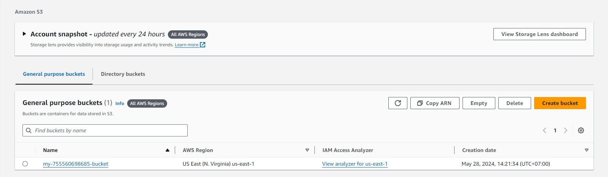
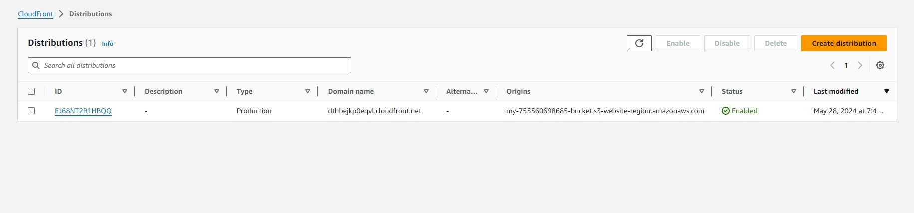
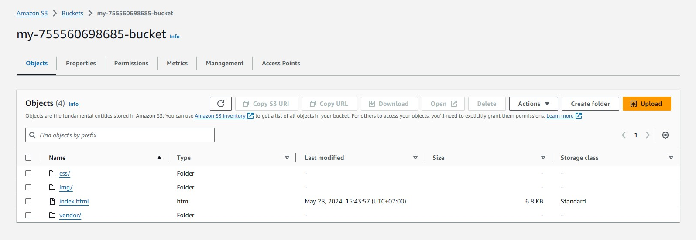
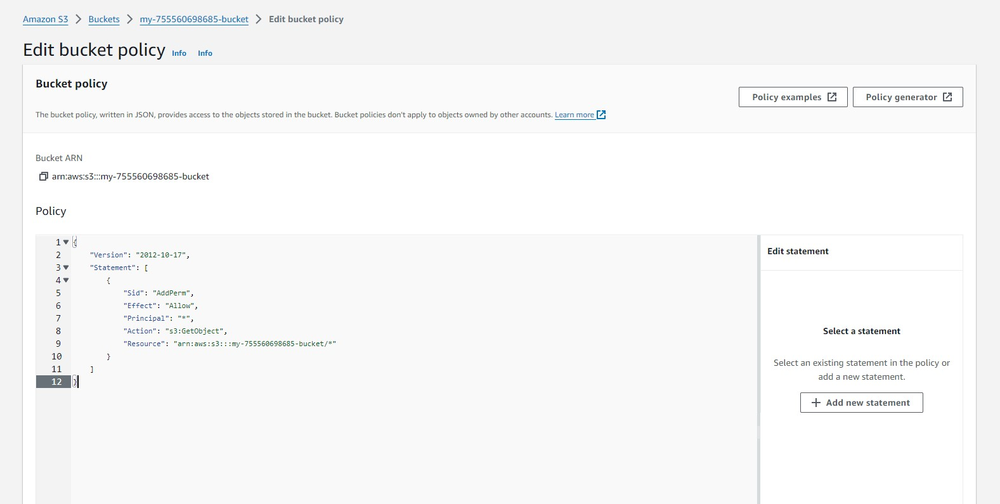
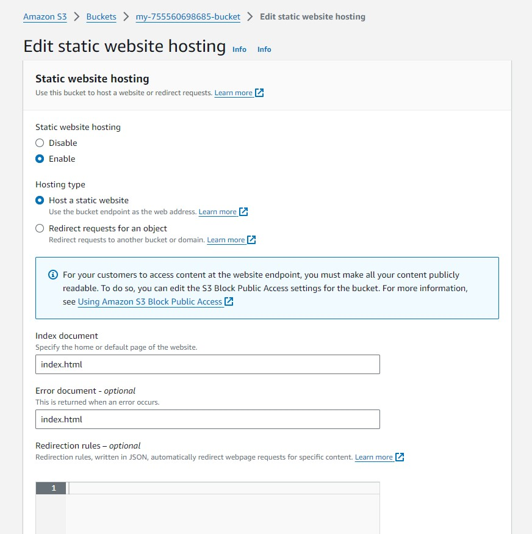

<h3 align="center">Deploy Static Website on AWS</h3>
 

According to the instructions, I have attached photos recording information during the process of deploying static website on AWS including:

 
<ol>
<li>Create a bucket on S3</li>
 
 
 
<li>Create distributions on CloudFront</li>

 
 
<li>Upload project to S3</li>

 
 
<li>Update bucket policy</li>

<li>Update static website hosting</li>

<li>Update static website hosting</li>

</ol>
 

* CloudFront domain name url at [http://my-755560698685-bucket.s3-website-us-east-1.amazonaws.com](http://my-755560698685-bucket.s3-website-us-east-1.amazonaws.com)

* Website endpoint url at [http://my-755560698685-bucket.s3-website-region.amazonaws.com](http://my-755560698685-bucket.s3-website-region.amazonaws.com)

Please rate it and give me feedback. If there is any information that needs to be changed, I will update and send it back to you. Thank you!
